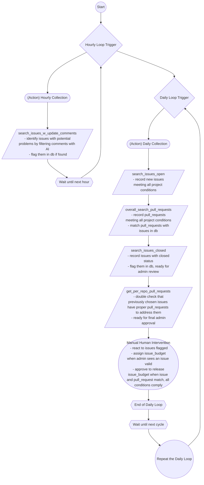

```mermaid
graph TD
    start((Start))
    hourlyLoopTrigger{Hourly Loop Trigger}
    actionHourlyCollection(["(Action) Hourly Collection"])
    searchIssuesUpdateComments[/search_issues_w_update_comments<br> - identify issues with potential problems by filtering comments with AI<br> - flag them in db if found/]
    waitNextHour{{Wait until next hour}}
    dailyLoopTrigger{Daily Loop Trigger}
    actionDailyCollection(["(Action) Daily Collection"])
    searchIssuesOpen[/search_issues_open<br> - record new issues meeting all project conditions/]
    overallSearchPullRequests[/overall_search_pull_requests<br> - record pull_requests meeting all project conditions<br> - match pull_requests with issues in db/]
    searchIssuesClosed[/search_issues_closed<br> - record issues with closed status<br> - flag them in db, ready for admin review/]
    getPerRepoPullRequests[/get_per_repo_pull_requests<br> - double check that previously chosen issues have proper pull_requests to address them<br> - ready for final admin approval/]
    manualHumanIntervention([Manual Human Intervention<br> - react to issues flagged<br> - assign issue_budget when admin sees an issue valid<br> - approve to release issue_budget when issue and pull_request match, all conditions comply])
    endOfDailyLoop{{End of Daily Loop}}
    waitNextCycle{{Wait until next cycle}}
    repeatDailyLoop((Repeat the Daily Loop))

    start --> hourlyLoopTrigger
    hourlyLoopTrigger --> actionHourlyCollection
    actionHourlyCollection --> searchIssuesUpdateComments
    searchIssuesUpdateComments --> waitNextHour
    waitNextHour --> hourlyLoopTrigger
    hourlyLoopTrigger --> dailyLoopTrigger
    dailyLoopTrigger --> actionDailyCollection
    actionDailyCollection --> searchIssuesOpen
    searchIssuesOpen --> overallSearchPullRequests
    overallSearchPullRequests --> searchIssuesClosed
    searchIssuesClosed --> getPerRepoPullRequests
    getPerRepoPullRequests --> manualHumanIntervention
    manualHumanIntervention --> endOfDailyLoop
    endOfDailyLoop --> waitNextCycle
    waitNextCycle --> repeatDailyLoop
    repeatDailyLoop --> dailyLoopTrigger
```
